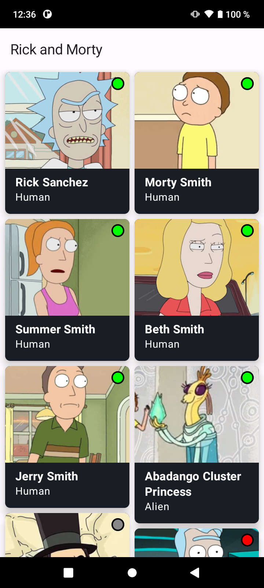
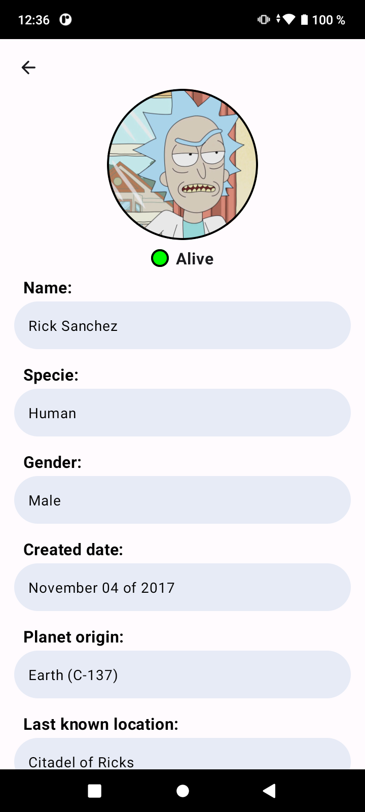

# Prueba técnica Global Mobility Apex, S.A.
### Descripción
Para esta prueba se utilizó Jetpack Compose, un marco de trabajo moderno para la creación de interfaces de usuario. Se adoptó el patrón de arquitectura MVVM (Model View ViewModel) para estructurar la lógica y la presentación de la aplicación de manera modular.

Adicionalmente, se implementaron prácticas de desarrollo reconocidas, como Clean Code (Código Limpio) y Don't Repeat Yourself (No te repitas), con el objetivo de mejorar la legibilidad, mantenibilidad y eficiencia del código fuente.

En el desarrollo de esta aplicación, se empleó el uso del servicio API [Rick And Morty](https://rickandmortyapi.com) como fuente simulada de datos, con el propósito de realizar solicitudes y obtener información, procesarla y mostrarla en la interfaz del aplicativo.

Esta aplicación tiene como objetivo principal listar los personajes de la serie "Rick and Morty". En la lista principal, cada elemento mostrará:
- Fotografía del personaje
- Un indicador de estado (Rojo: Muerto, Verde: Vivo, Gris: Desconocido)
- Nombre del personaje
- Especie del personaje (Humano, Alien, etc.)

Al tocar cada personaje en la lista, se accederá a su detalle, donde se mostrarán aspectos como:
- Fotografía del personaje
- Estado (Vivo, Muerto o Desconocido)
- Nombre
- Género (Masculino, Femenino, etc.)
- Planeta de origen
- Último planeta conocido
- Fecha de creación del personaje

Es importante destacar que la aplicación está en inglés, ya que la API de [Rick And Morty](https://rickandmortyapi.com) proporciona respuestas en este idioma y no en español.

### Screenshots
&nbsp;&nbsp;&nbsp;&nbsp;

### Instrucciones para correr la aplicación
1. Clonar el repositorio utilizando el siguiente comando:
```bash
git clone https://github.com/juanjmorelos/RickAndMorty.git
```
2. Una vez completada la descarga, abrir el proyecto con el entorno de desarrollo Android Studio y compilar.

### Descargar APK
Para obtener el archivo de instalación (APK), por favor, haga clic en el siguiente enlace: [Descargar Rick And Morty.apk](https://github.com/juanjmorelos/RickAndMorty/raw/master/extras/jks%20y%20apk/Rick%20And%20Morty.apk)
